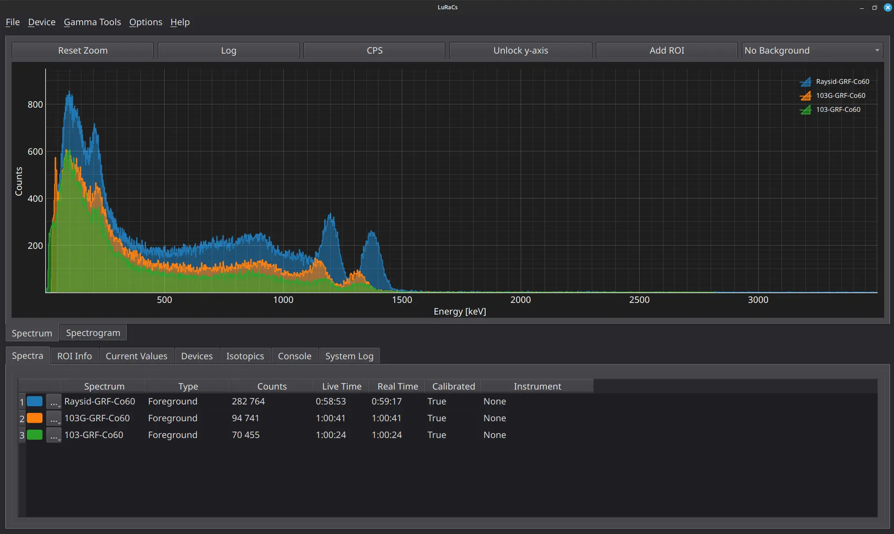

# LuRaCs - *Lund Radiation analysis Computer software*

 [](https://creativecommons.org/licenses/by-sa/4.0/)   

LuRaCs is a free, open-source application designed for the measurement and analysis of nuclear radiation. While its functionality ranges from basic to advanced radiation analysis, with primary focus is on gamma spectrometry. Built with Qt and primarily written in Python, the software is designed with extensibility in mind, enabling support for a variety of detector systems.

- [LuRaCs - *Lund Radiation analysis Computer software*](#luracs---lund-radiation-analysis-computer-software)
  - [Features](#features)
    - [Spectrum View](#spectrum-view)
    - [Analysis Tools](#analysis-tools)
    - [Time Series Measurements](#time-series-measurements)
    - [Area Mapping](#area-mapping)
    - [CLI](#cli)
    - [Implemented Instruments](#implemented-instruments)
  - [Installation](#installation)
  - [Documentation](#documentation)
  - [Licence](#licence)
  - [Third-party assets](#third-party-assets)

## Features
- Simultaneous measurements with several instruments
- Data export (.n42, .csv, .xlsx)
- ROI selection with peak fitting, automatic updates during measurement
- Calibration and calculation of detector characteristics
- Nuclide data with spectrum reference lines
- Control trough a command line interface
- Time series and spectrogram measurements
- Area Mapping with a generic GPS connected through USB
### Spectrum View
The spectrum view offers a count histogram retrieved from an instrument or loaded from a saved file. *Regions Of Interest* (ROI) can be defined in which a Gaussian peak can be fitted and the result from the fit used for further analysis.



### Analysis Tools
LuRaCs offers a set of tools for analysing a measured *spectrum*. A spectrum can be calibrated to known emissions and instrument characteristics such as energy resolution and intrinsic efficiency can calculated and stored. 
If you are only interested in analysing already measured spectra we recommend you to use [Interspec](https://sandialabs.github.io/InterSpec/) instead due to its wider compatibility.

### Time Series Measurements
When an instrument is connected, reading can be measured in a time series in the form of a *spectrogram*. A spectrogram saves the mean values of the count- and dose rate during each save interval as well as the collected spectrum.

### Area Mapping
By connecting an external GPS through USB area mapping can be carried out by extending the normal spectrogram measurements. Maps can be requested from an internet URL or provided from a downloaded file for offline use.
### CLI
While the GUI provides to most common interface, LuRaCs also supports control through a Command Line Interface. Enabling efficient use over an ssh tunnel for connecting the remotely connected instruments, for instance used with a *RaspberryPi*.

The CLI is started by running with the `--headless` flag.

 


### Implemented Instruments
Currently, drivers for the following instruments are included by default
- [RadiaCode-1xx series](https://www.radiacode.com/100-series)
- [Raysid](https://raysid.com/)

## Installation
Requires Python 3.10 or newer.
Clone the repository and install using pip:

```shell
git clone --recursive https://github.com/EBELU/LuRaCs.git
cd LuRaCs/

pip install .
```
## Documentation
LuRaCs documentation can be found [here](luracs/resources/docs/documentation/Welcome.md) or under the *Help*-tab in the open program. 

## Licence
The LuRaCs source code is licensed under the GPL-3.0 license.

The LuRaCs documentation and images are licensed under the CC BY-SA 4.0 license.


## Third-party assets

This application uses Material Design Icons  
https://pictogrammers.com/library/mdi/  

Material Design Icons are licensed under the Apache License 2.0.

A copy of the Apache 2.0 license is included in the `/licenses` directory.