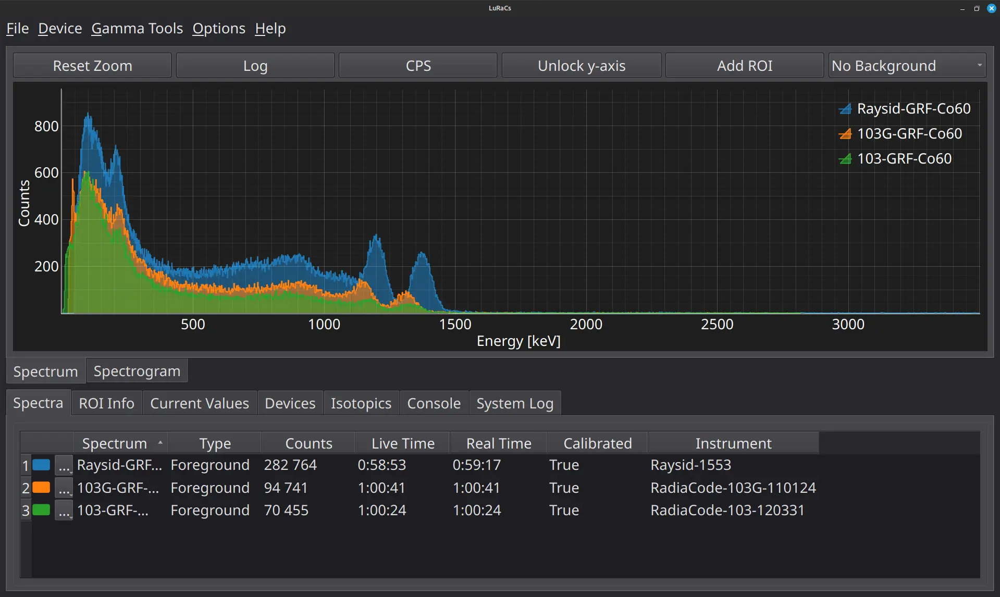
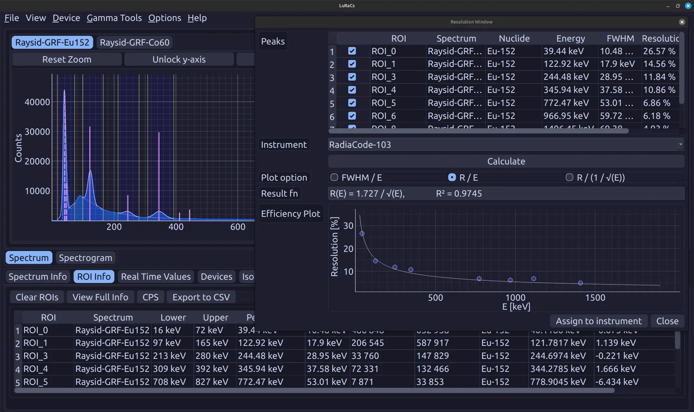
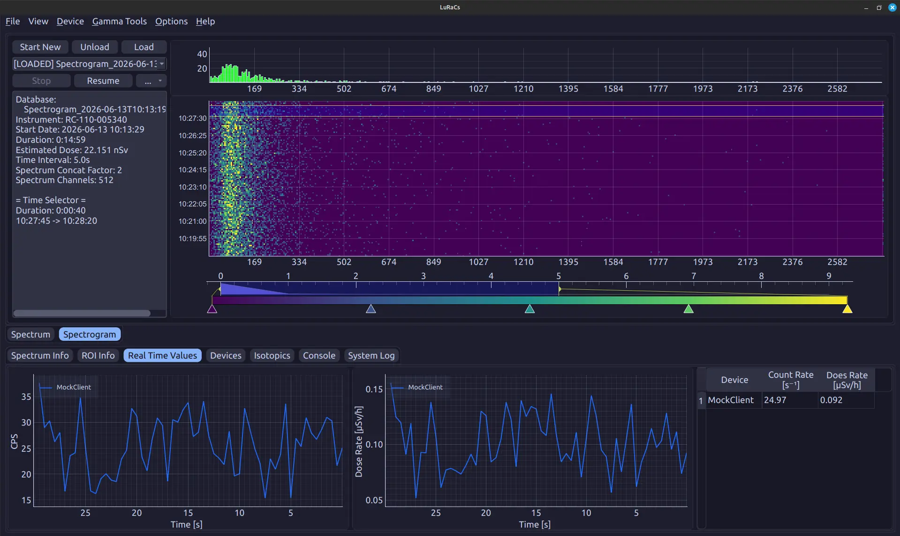
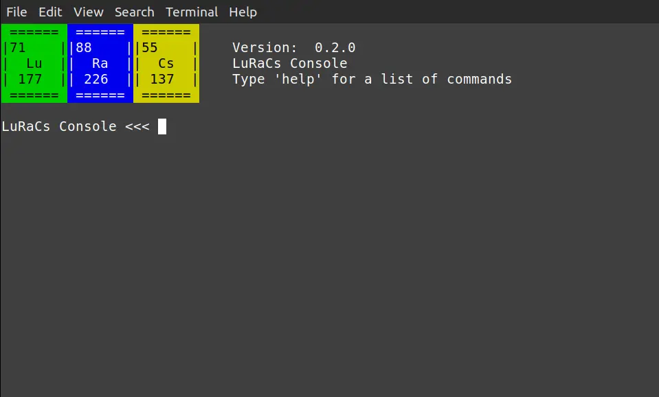
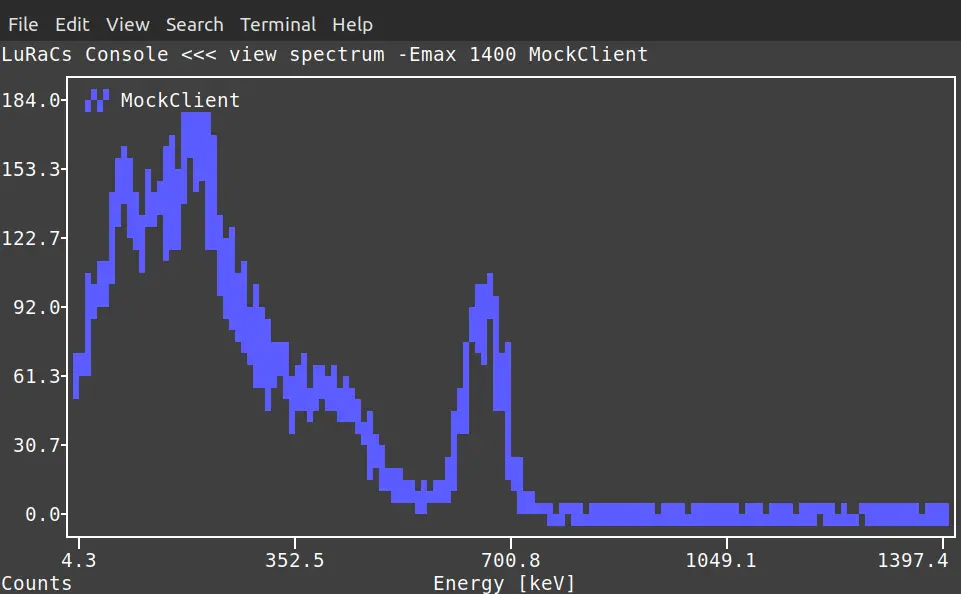

# LuRaCs - *Lund Radiation analysis Computer software*

 [](https://creativecommons.org/licenses/by-sa/4.0/)   

LuRaCs is a free, open-source application designed for the measurement and analysis of nuclear radiation. While its functionality ranges from basic to advanced radiation analysis, with primary focus is on gamma spectrometry. Built with Qt and primarily written in Python, the software is designed with extensibility in mind, enabling support for a variety of detector systems.

- [LuRaCs - *Lund Radiation analysis Computer software*](#luracs---lund-radiation-analysis-computer-software)
  - [Features](#features)
    - [Spectrum View](#spectrum-view)
    - [Analysis Tools](#analysis-tools)
    - [Time Series Measurements](#time-series-measurements)
    - [Area Mapping](#area-mapping)
    - [CLI](#cli)
    - [Implemented Instruments](#implemented-instruments)
  - [Installation](#installation)
  - [Documentation](#documentation)
  - [Licence](#licence)
  - [Third-party assets](#third-party-assets)

## Features
- Simultaneous measurements with multiple instruments
- Data export to common formats (.n42, .csv, .xlsx)
- ROI selection with peak fitting and automatic updates during measurement
- Calibration and determination of detector characteristics
- Nuclide data with reference emission lines
- Command line interface for remote control and automation
- Time-series and spectrogram-based measurements
- Area mapping using a generic USB-connected GPS device
### Spectrum View
The spectrum view shows a count histogram retrieved from an instrument or loaded from a file. *Regions Of Interest* (ROI) can be defined in which a Gaussian peak can be fitted and the result from the fit used in analysis tools.



### Analysis Tools
LuRaCs provides a comprehensive set of tools for analysing measured spectra. Spectra can be calibrated using known emission lines, and key instrument characteristics such as energy resolution and intrinsic efficiency can be determined, visualized, and stored for future use.

If your primary goal is the analysis of previously acquired spectra, we recommend using [InterSpec](https://sandialabs.github.io/InterSpec/), which offers broader compatibility with a wide range of spectrum file formats and analysis workflows.

### Time Series Measurements
When an instrument is connected, measurements can be recorded as a time series in the form of a *spectrogram*. A spectrogram stores the average count rate and dose rate for each acquisition interval, together with the corresponding accumulated spectrum. This enables both temporal trend analysis and detailed examination of the spectral data collected throughout the measurement period.

### Area Mapping
By connecting an external GPS device via USB, area mapping can be performed by extending standard spectrogram measurements with positional data. Maps can be retrieved from an online source via URL or loaded from a locally stored file for offline use.
### CLI
While the graphical user interface provides the primary means of interaction, LuRaCs also supports control via a Command Line Interface. This enables efficient remote operation, for example over an SSH connection to remotely deployed instruments such as a *Raspberry Pi*.

The CLI is started by running with the `--headless` flag.

 


### Implemented Instruments
Currently, drivers for the following instruments are included by default
- [RadiaCode-1xx series](https://www.radiacode.com/100-series) (USB, BLE)
- [Raysid](https://raysid.com/) (BLE)

## Installation
Requires Python 3.10, 3.11, 3.12 or 3.13.
Clone the repository and install using pip:

```shell
git clone --recursive https://github.com/EBELU/LuRaCs.git
cd LuRaCs/

pip install .
```
## Documentation
LuRaCs documentation can be found [here](luracs/resources/docs/documentation/Welcome.md) or under the *Help*-tab in the open program. 

## Licence
The LuRaCs source code is licensed under the GPL-3.0 license.

The LuRaCs documentation and images are licensed under the CC BY-SA 4.0 license.


## Third-party assets

This application uses Material Design Icons  
https://pictogrammers.com/library/mdi/  

Material Design Icons are licensed under the Apache License 2.0.

A copy of the Apache 2.0 license is included in the `/licenses` directory.